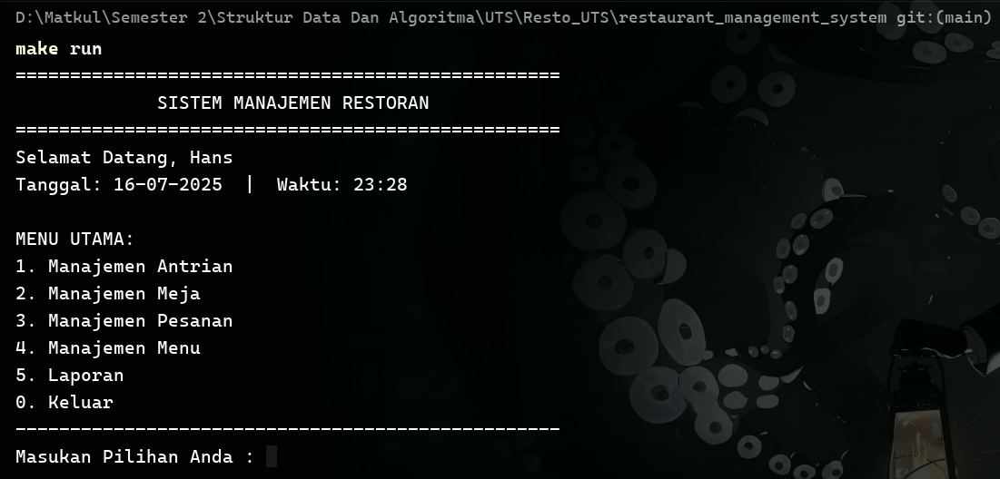
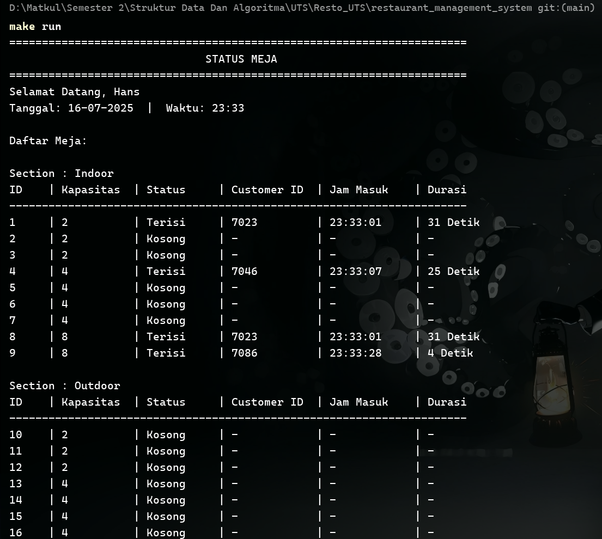
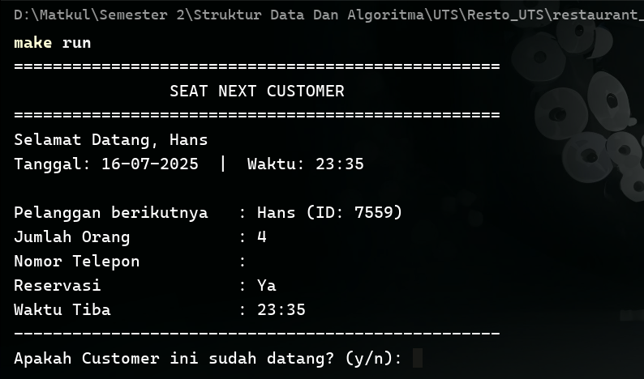

# Sistem Manajemen Restoran (C++)

Sebuah aplikasi konsol berbasis C++ yang dirancang untuk mensimulasikan dan mengelola operasional dasar sebuah restoran. Proyek ini dibuat sebagai tugas akhir untuk mata kuliah Struktur Data dan Algoritma.

## 📜 Deskripsi Proyek

Sistem Manajemen Restoran ini adalah sebuah solusi perangkat lunak sederhana yang bertujuan untuk mendigitalisasi alur kerja di restoran, mulai dari pelanggan datang hingga mereka menyelesaikan pembayaran. Aplikasi ini menangani berbagai aspek operasional, termasuk pengelolaan antrian, meja, menu, pesanan, hingga pembuatan laporan sederhana untuk analisis bisnis.

Proyek ini sepenuhnya dibangun menggunakan C++ dengan pendekatan modular untuk memastikan kode yang bersih, terstruktur, dan mudah dikelola.

## ✨ Fitur Utama

Aplikasi ini dilengkapi dengan beberapa modul manajemen utama:

* **🚶‍♂️ Manajemen Antrian:**
    * Membedakan antara antrian pelanggan biasa (*walk-in*) dan antrian reservasi.
    * Memberikan prioritas kepada pelanggan reservasi.
* **🍽️ Manajemen Meja:**
    * Menampilkan status semua meja secara *real-time* (terisi/kosong).
    * Menempatkan pelanggan ke meja yang sesuai.
    * Memfasilitasi proses *checkout* untuk mengosongkan meja.
* **📖 Manajemen Menu:**
    * Menampilkan daftar menu yang dikelompokkan berdasarkan kategori.
    * Menambah item baru ke dalam menu.
    * Mengubah status ketersediaan item (Tersedia/Habis).
* **📝 Manajemen Pesanan:**
    * Membuat pesanan baru untuk meja yang spesifik.
    * Mencatat beberapa item dalam satu transaksi pesanan.
    * Melihat daftar semua pesanan yang sedang aktif atau sudah selesai.
* **💳 Proses Checkout:**
    * Menghitung total tagihan secara otomatis dari semua pesanan di satu meja.
    * Memproses pembayaran dengan berbagai metode.
    * Mencetak struk pembayaran digital ke dalam file `.txt`.
* **📊 Laporan:**
    * Menghasilkan laporan pendapatan harian.
    * Menghasilkan laporan performa menu untuk melihat item terlaris.

## 🛠️ Teknologi yang Digunakan

* **Bahasa Pemrograman:** C++
* **Compiler:** MinGW-w64 (GCC)
* **Sistem Build:** `make` / `mingw32-make`
* **Editor Kode:** Visual Studio Code

## 📁 Struktur Proyek

Proyek ini diorganisir dengan struktur folder yang modular:

```
restaurant_management_system/
│
├── src/                # Berisi semua file implementasi (.cpp)
│   ├── main.cpp
│   ├── queue_manager.cpp
│   ├── table_manager.cpp
│   └── ...
│
├── include/            # Berisi semua file header (.h)
│   ├── restaurant_system.h
│   ├── queue_manager.h
│   └── ...
│
├── bin/                # Folder untuk menyimpan file executable hasil kompilasi
│
├── obj/                # Folder untuk menyimpan file objek (.o)
│
└── Makefile            # File instruksi untuk kompilasi proyek
```

## 🚀 Cara Menjalankan Proyek

Untuk mengompilasi dan menjalankan proyek ini di sistem Anda, pastikan Anda telah menginstal **MinGW** (dengan `g++`) dan **Make** (`mingw32-make`), serta telah menambahkannya ke `PATH` environment variable.

1.  **Buka Terminal**
    Buka terminal (Command Prompt, PowerShell, atau Git Bash) di direktori utama proyek.
2.  **Bersihkan Build Lama (Opsional)**
    Jika Anda ingin melakukan kompilasi ulang dari awal, jalankan perintah:
    ```bash
    mingw32-make clean
    ```
3.  **Kompilasi Proyek**
    Gunakan perintah `make` untuk memulai proses kompilasi.
    ```bash
    mingw32-make
    ```
    Jika Anda telah membuat alias `make.exe` dari `mingw32-make.exe`, Anda bisa menggunakan:
    ```bash
    make
    ```
4.  **Jalankan Aplikasi**
    Setelah kompilasi berhasil, file `main.exe` akan dibuat di dalam folder `bin`. Jalankan dengan perintah:
    ```bash
    .\bin\main.exe
    ```
    Atau di terminal berbasis Linux (seperti Git Bash):
    ```bash
    ./bin/main.exe
    ```

## 📸 Tampilan Aplikasi

**Menu Utama:**


**Tampilan Daftar Meja:**


**Proses Pembuatan Pesanan:**



## 👨‍💻 Kontributor

Dibuat oleh **Helgi Nur Allamsyah** - **202404010**
